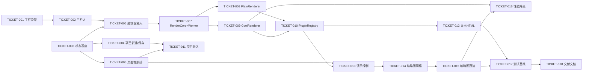

# geek-ppt 设计方案（PRD + 架构设计）

## 1. 文档目的

本文档用于将 `geek-ppt` 的产品目标、功能边界、系统架构与交付路径一次性定义清楚，供开发团队直接据此拆解任务并实施。

适用范围：
- 第一阶段：纯本地单机使用，聚焦单人编辑与离线演示。
- 导出目标：`单 HTML + 资源目录`。
- 内容生产方式：用户仅编辑 Markdown。
- 渲染机制：所有语法渲染均由插件体系负责。

---

## 2. 产品目标与非目标

### 2.1 产品目标

1. 让用户通过编辑 Markdown 快速制作演示文稿。
2. 系统自动完成排版与渲染，降低用户设计成本。
3. 产出可在浏览器直接打开并演示的 HTML 演示包。
4. 提供可扩展插件体系，支持多种渲染风格与语法处理策略。
5. 支持项目导入后继续编辑，实现“制作-保存-复用”闭环。

### 2.2 非目标（第一阶段不做）

1. 多人实时协作与冲突合并能力。
2. 账号、登录、鉴权、权限管理等用户体系。
3. 云端存储、云同步、远程发布平台。
4. 复杂工作流（审批、发布审批链）。
5. 完整插件市场平台（第一版仅内置插件机制）。

---

## 3. 目标用户与核心场景

### 3.1 目标用户

- 技术分享者（需要快速把文本和代码转成演示）。
- 商务汇报用户（希望高效产出结构化演示）。
- 教学培训讲师（按章节组织内容并现场演示）。
- 通用内容创作者（希望低门槛制作幻灯片）。

### 3.2 核心场景

1. 新建项目 -> 编辑 Markdown -> 实时预览 -> 导出演示包。
2. 导入历史项目 -> 继续编辑 -> 重新导出。
3. 切换渲染插件（主题/布局/语法解释方式）对比效果。

### 3.3 成功标准（第一阶段）

- 用户在 15 分钟内可完成一份 10 页以内演示稿并导出成功。
- 基础演示包可在主流 Chromium 浏览器离线打开并完整播放。
- 导入历史项目后内容完整可编辑，渲染结果一致性可接受。

---

## 4. 产品范围（功能清单）

### 4.1 必做功能（MVP + v1）

1. **项目管理**
   - 新建项目。
   - 保存项目。
   - 导入项目继续编辑。

2. **页面组织**
   - 页面列表展示。
   - 新增/删除/重排页面。
   - 当前页面定位与快速切换。

3. **内容编辑**
   - 每页独立编辑器，一页对应一个 Markdown 编辑区。
   - 支持快捷键保存、预览刷新。
   - 资源插入：支持拖拽文件到编辑器、文件选择器上传、粘贴剪贴板图片。
   - 资源上传后自动存入 `assets/` 并在编辑器中插入标准 Markdown 引用（如 ``）。

4. **实时预览**
   - 编辑区变更后触发渲染（渲染在 Web Worker 中执行，不阻塞编辑）。
   - 预览区展示当前页（可扩展为整篇预览）。
   - 顶部功能区提供"预览"按钮，点击后进入演示预览模式。

5. **渲染插件系统**
   - 第一版提供三个内置插件：`PlainRenderer`（朴素）、`CoolRenderer`（酷炫）、`TorrentRenderer`（激流）。
   - 包含 Mermaid 图表渲染支持。
   - 插件声明能力（支持哪些 Markdown 语法节点）。
   - 插件渲染输出 HTML 片段与样式。
   - 插件失败时降级处理（回退渲染）。

6. **自定义渲染主题**
   - 支持基于内置插件（底座）自定义样式。
   - 提供可视化 CSS 编辑界面，支持逐项语法配置。
   - 支持主题导入、导出（JSON 格式）。
   - 渲染引擎自动注入底层骨架 CSS，用户仅需关注差异化样式。

6. **演示模式导航**
   - 固定显示上一页、下一页控件。
   - 固定显示当前页码（示例：`05 / 29`）。
   - 点击页码弹出“全部页面缩略图网格”。
   - 点击任意缩略图可直接跳转到目标页。
   - 支持键盘方向键与点击跳转行为一致。

7. **导出功能**
   - 导出 `index.html + assets/` 目录结构。
   - 导出产物可离线打开演示。

8. **幻灯片尺寸设置**
   - 支持用户选择幻灯片画布比例，默认 16:9。
   - 常用预设尺寸：

   | 名称 | 比例 | 像素（参考） | 适用场景 |
   |------|------|-------------|---------|
   | 宽屏（默认） | 16:9 | 1920 × 1080 | 现代显示器、投影仪 |
   | 标准 | 4:3 | 1024 × 768 | 传统投影仪、兼容性优先 |
   | 超宽屏 | 21:9 | 2560 × 1080 | 超宽显示器演示 |
   | 竖屏 | 9:16 | 1080 × 1920 | 手机/竖屏展示场景 |
   | A4 横版 | ≈1.414:1 | 1123 × 794 | 需要打印的场景 |

   - 选择后全局生效，影响预览区与导出产物的画布尺寸。

9. **演讲者备注（Speaker Notes）**
   - 编辑区底部提供可折叠的备注面板。
   - 每页可独立编写备注内容（纯文本）。
   - 备注不参与渲染和导出，仅在编辑器中可见。

10. **基础版式模板（内置）**
    - 每个插件提供以下预设版式，用户新建页面时可选：
      - 封面页（大标题居中）。
      - 内容页（标题 + 正文）。
      - 双栏对比页（左右分栏）。
    - 选择模板后自动填充对应的 Markdown 骨架。

### 4.2 可选增强（v1.1+）

- 模板与主题包管理（扩展更多版式模板）。
- 资源压缩与导出体积优化。

---

## 5. UI 信息架构（基于图1）

### 5.1 页面布局分区

1. **顶部功能区**
   - 项目操作：新建、导入、保存、导出。
   - 预览按钮：点击进入演示预览模式。
   - 插件与主题切换入口。
   - 幻灯片尺寸切换入口。
   - 运行状态提示（已保存/未保存/导出中）。

2. **左侧页面列表区**
   - 按页展示缩略信息（页号 + 标题）。
   - 支持页面顺序调整。
   - 支持快速增删页。

3. **中间内容编辑区**
   - 当前页面 Markdown 编辑器（每页独立编辑）。
   - 基础编辑辅助（行号、语法高亮可选）。
   - 支持拖拽/选择/粘贴方式插入资源。
   - 底部可折叠演讲者备注面板。

4. **右侧预览区**
   - 当前页渲染结果。
   - 支持刷新、缩放、演示模式入口。

### 5.2 关键交互流程

流程 A：编辑并预览
1. 用户在中间编辑 Markdown。
2. 系统触发渲染管线。
3. 右侧预览实时更新。

流程 B：导出
1. 用户点击导出。
2. 系统组装页面与资源。
3. 生成 `index.html + assets/` 并下载到本地。

流程 C：导入继续编辑
1. 用户选择项目文件（含配置和资源）。
2. 系统校验版本与结构。
3. 解析成功后恢复页面与插件配置。

### 5.3 演示模式交互规范（v1 必做）

**进入与退出**：
- 通过顶部功能区"预览"按钮进入演示模式。
- 全屏演示使用浏览器原生全屏功能（`F11` 或右键全屏），应用不做专门处理。
- 按 `Esc` 或点击关闭按钮退出演示模式，返回编辑界面。

1. **基础控制区**
   - 右侧或底部固定展示上一页、下一页按钮。
   - 中间展示当前页码，格式为 `current / total`，例如 `03 / 18`。

2. **页码点击行为**
   - 点击页码后，弹出全量页面缩略图网格（非章节子集）。
   - 网格项至少显示：页号、标题（若有）、缩略渲染图。
   - 当前页缩略图需高亮。

3. **跳转行为**
   - 点击缩略图：关闭弹层并直达目标页。
   - 按 `Esc`：关闭弹层，不改变当前页。
   - 打开弹层后支持滚动浏览，页数较多时采用懒加载缩略图。

4. **一致性要求**
   - 键盘跳页、按钮跳页、缩略图跳页三者共享同一跳页状态机。
   - 任意方式跳页后，页码显示与当前页高亮必须同步刷新。

### 5.4 快捷键方案（v1）

| 快捷键 | 功能 |
|--------|------|
| `Ctrl/Cmd + S` | 保存项目 |
| `Ctrl/Cmd + N` | 新增页面 |
| `Ctrl/Cmd + Delete` | 删除当前页 |
| `F5` | 进入演示预览模式 |
| `Esc` | 退出演示模式 / 关闭弹层 |
| `PageUp` / `←` / `↑` | 上一页（演示模式） |
| `PageDown` / `→` / `↓` | 下一页（演示模式） |

### 5.5 基础可访问性要求（v1）

1. 演示模式导航控件（上一页/下一页/页码）支持 Tab 键聚焦与 Enter 键触发。
2. 缩略图网格弹出后焦点自动移入，`Esc` 关闭后焦点回到页码按钮。
3. CoolRenderer 深色背景上的文字对比度不低于 4.5:1（WCAG AA 标准）。

---

## 6. 技术总体方案

### 6.1 技术栈选型（已确定）

| 类别 | 选型 | 理由 |
|------|------|------|
| 前端框架 | React + TypeScript | 插件生态成熟、组件解耦、长期维护 |
| 状态管理 | Zustand | API 简洁、无 Provider 嵌套、DevTools 支持 |
| 编辑器 | CodeMirror 6 | 轻量（~200KB vs Monaco ~2MB）、移动端友好、扩展性好 |
| Markdown 解析器 | unified / remark | AST 生态最成熟、插件扩展性强、社区活跃 |
| 构建工具 | Vite | 开发热更新快、构建产物小 |
| 样式隔离 | Shadow DOM | 完全隔离插件与宿主样式、天然防泄漏、利于未来第三方插件扩展 |
| 本地持久化 | File System Access API | 直接读写用户磁盘、不怕清缓存、天然支持大资源 |
| 项目文件格式 | `.geekppt`（ZIP 容器） | 单文件易分享、内部结构保持 JSON + MD + assets |
| 渲染线程 | Web Worker | 渲染不阻塞编辑器主线程、异常不影响 UI |
| UI 组件库 | shadcn/ui（Radix UI + Tailwind CSS） | 组件代码可控、Radix 内置 a11y、Tailwind 快速定制样式 |
| 代码高亮 | Shiki | VSCode 同款引擎、主题丰富、与 unified 生态有成熟集成 |
| 包管理器 | npm | 团队统一标准 |

说明：
- React + TS 更适合插件生态、组件解耦与长期维护。
- 初期避免引入重后端依赖，保持本地优先。
- 目标浏览器为 Chromium 系列（Chrome / Edge），File System Access API 在此范围内完全可用。

### 6.2 架构原则

1. 编辑与导出复用同一渲染核心，避免“预览和导出不一致”。
2. 渲染能力全部由插件承接，核心只负责管线编排与容错。
3. 渲染核心运行在 Web Worker 中，与 UI 主线程隔离。
4. 代码语法高亮作为渲染核心的基础能力统一提供，插件不重复实现。
5. 项目格式版本化，支持后续兼容升级。
6. UI 层与渲染引擎解耦，便于未来替换编辑器/预览器。
7. 插件渲染输出挂载到 Shadow DOM 中，实现宿主与插件、插件与插件间的完全样式隔离。

---

## 7. 系统架构设计

### 7.1 逻辑分层

1. **UI Layer**
   - 页面布局、交互事件、状态展示。

2. **Application Layer**
   - 项目生命周期管理（新建/导入/保存/导出）。
   - 渲染流程编排。

3. **Rendering Core**
   - Markdown 解析。
   - 语法节点分发。
   - 插件执行与结果聚合。

4. **Plugin Runtime**
   - 插件注册、能力声明、渲染接口调用。
   - 异常隔离与降级。

5. **Rendering Worker**
   - Markdown 解析与插件渲染在 Web Worker 中执行。
   - 通过 postMessage 与主线程通信，返回渲染结果。
   - 渲染超时保护与异常隔离。

6. **IO Layer**
   - 项目文件读写（基于 File System Access API）。
   - 资源文件引用与导出打包。
   - 项目文件以 `.geekppt`（ZIP 容器）格式存储和传输。

### 7.2 核心数据流

1. 用户编辑 Markdown 文本。
2. 编辑器将文本通过 postMessage 发送到 Render Worker。
3. Worker 中 unified/remark 解析器生成中间表示（IR）。
4. 渲染核心按节点类型路由到插件（代码块节点统一走语法高亮基础能力）。
5. 插件返回 HTML/样式/元信息。
6. 渲染核心聚合为页面 HTML 结构，通过 postMessage 返回主线程。
7. 预览区展示；导出时复用相同结果写入 HTML。

---

## 8. 渲染插件体系设计（v1 双插件）

### 8.1 设计目标

- 全语法插件化。
- 第一版收敛为两个内置插件，降低交付风险。
- 插件行为可观测（错误、耗时、降级）。

### 8.2 v1 插件清单与职责

1. `PlainRenderer`（朴素渲染）
   - 目标：提供最稳定、最轻量、最接近原始 Markdown 的展示效果。
   - 特点：弱动效、低视觉装饰、强可读性。

2. `CoolRenderer`（酷炫渲染）
   - 目标：提供高视觉冲击力的演示风格。
   - 特点：毛玻璃背景、霓虹光韵、增强转场与元素入场动画。

3. `TorrentRenderer`（激流渲染）
   - 目标：提供极具表现力的暗黑科技风格。
   - 特点：动态光球轨迹背景、霓虹渐变标题、独特的“行合并”排版策略。

### 8.3 Markdown 语法全覆盖渲染策略

每个渲染插件必须对以下所有 Markdown 语法节点提供对应的渲染策略。下表定义了 v1 两个插件各自的渲染行为：

| 语法节点 | AST 类型 | PlainRenderer（朴素） | CoolRenderer（酷炫） | TorrentRenderer（激流） |
|---------|---------|---------------------|---------------------|-----------------------|
| **标题** h1-h6 | `heading` | 标准字号递减、加粗 | 渐变色文字、入场动画 | 霓虹渐变、呼吸动效 (h1) |
| **段落** | `paragraph` | 标准行高、段间距 | 毛玻璃容器内居中 | 宽行高、入场逐行位移偏移 |
| **粗体** | `strong` | `font-weight: bold` | 亮白/亮黄 + 微发光 | 亮黄霓虹 + 阴影发光 |
| **代码块** | `code` | Shiki 浅色主题 | Shiki 深色主题 + 毛玻璃 | Shiki 深色主题 + 暗透明底 |
| **表格** | `table` | 斑马纹、细线 | 半透明、悬浮高亮 | 渐变色表头、暗色边框 |
| **列表** | `list` | 标准圆点/数字 | 渐变圆点、入场动画 | 渐变圆点、独特的行合并渲染 |
| **Mermaid** | `html` | 默认渲染 | 默认渲染 | 透明底、适配暗色主题 |


**通用规则**：
- 未在上表中的节点类型，由 fallback renderer 按朴素样式输出。
- 代码块语法高亮统一由渲染核心调用 Shiki 完成，插件仅负责容器样式。
- 所有节点渲染异常时降级为纯文本输出，不阻塞页面。

### 8.4 插件能力模型（概念）

每个插件至少声明：
1. `pluginId`：唯一标识。
2. `version`：插件版本。
3. `supportedNodeTypes`：支持的语法节点类型（v1 必须覆盖上表全部类型）。
4. `render(node, context)`：渲染函数。
5. `getStyles()`：返回插件样式片段（可选）。

### 8.5 插件执行流程

1. 渲染核心接收解析后的节点序列。
2. 逐节点查找可处理插件。
3. 插件输出 HTML 片段。
4. 统一聚合为页面 HTML。
5. 未匹配节点进入回退插件（fallback renderer）。

### 8.6 错误处理策略

1. 插件渲染异常不阻塞全页渲染。
2. 出错节点使用降级样式输出错误占位。
3. 记录日志（插件 ID、节点类型、错误摘要）。
4. UI 提示“部分内容渲染失败”。

### 8.7 CoolRenderer 视觉规范（第一版）

1. **整体布局规范**
   - 所有内容在页面中**水平居中、垂直居中**显示。
   - 内容区域最大宽度不超过画布宽度的 85%，保证两侧留白。
   - 多行内容按自然流排列，整体居中对齐。

2. **背景层规范**
   - 基础层：深色渐变背景（蓝紫/洋红方向）。
   - 毛玻璃层：内容容器背景使用半透明 + 背景模糊。
   - 光韵层：局部霓虹光斑（圆形或柔和椭圆），避免覆盖主体文本。

3. **色彩与字体规范**
   - 主标题支持渐变色（青蓝 -> 紫红）。
   - 强调数字使用高亮纯色（黄、青、粉）。
   - 正文字体保持高对比，最小正文建议不低于 28px（演示模式）。

4. **动效规范（增强版）**
   - 页面转场：淡入叠加轻微位移，不使用高眩晕特效。
   - 元素入场：按内容层级分批出现（标题 -> 主体 -> 注释）。
   - 导航动效：页码和缩略图弹层开合使用 180ms-260ms 过渡。

5. **性能降级策略**
   - 检测低性能设备时，降低光韵层数量与模糊半径。
   - 关闭高成本粒子或复杂滤镜，保留基本渐变与排版。
   - 动效可降级为仅透明度过渡，保证可读与流畅。

### 8.8 参考图映射（风格样例）

参考图存放于 `docs/参考图/` 目录。

1. 参考图 A：大标题渐变 + 深色氛围底图，映射到封面模板样式。
2. 参考图 B：口号型单页 + 强对比字幕，映射到观点陈述模板。
3. 参考图 C：大数字四宫格，映射到数据指标模板。
4. 参考图 D：对比叙事布局，映射到“左右对照”模板。

---

## 9. 数据模型设计（概念级）

### 9.1 Project

- `projectId`
- `name`
- `createdAt`
- `updatedAt`
- `slides[]`
- `pluginConfig`
- `themeConfig`
- `slideSize`（画布尺寸，如 `{ width: 1920, height: 1080, label: "16:9" }`）
- `formatVersion`

### 9.2 Slide

- `slideId`
- `order`
- `title`
- `markdownContent`
- `notes`（演讲者备注，默认空字符串）
- `template`（版式模板标识，如 `cover` / `content` / `two-column`，可选）

### 9.3 Asset

- `assetId`
- `path`
- `type`（image/video/font/...）
- `hash`
- `size`

### 9.4 RenderContext

- `projectMeta`
- `theme`
- `currentSlide`
- `assetResolver`

---

## 10. 项目文件格式设计（导入/继续编辑）

### 10.1 文件格式

项目采用 `.geekppt` 单文件格式（本质为 ZIP 容器），便于用户分享、备份与导入。

内部目录结构：

```text
my-presentation.geekppt (ZIP)
├── project.json
├── slides/
│   ├── 001.md
│   ├── 002.md
│   └── 003.md
├── assets/
│   ├── image-01.png
│   └── logo.svg
└── plugins/
    └── lock.json
```

### 10.2 核心文件说明

1. `project.json`
   - 项目元数据、页面顺序、插件配置、画布尺寸、版本号。

2. `slides/*.md`
   - 每页一个 Markdown 文件，便于版本管理与冲突处理。

3. `assets/`
   - 本地资源统一存放，Markdown 中使用相对路径引用（如 ``）。

4. `plugins/lock.json`
   - 当前项目依赖的插件版本快照，确保导入后渲染一致性。

### 10.3 读写机制

- **保存**：通过 File System Access API 将内存中的项目结构打包为 ZIP 并写入用户选择的磁盘路径。
- **导入**：用户选择 `.geekppt` 文件后，解压到内存并还原项目状态。
- **自动保存**：编辑产生脏状态后，定时（如 30 秒）自动保存到上次写入的文件句柄。

### 10.4 兼容策略

1. 项目格式采用 `formatVersion`。
2. 导入时执行版本检查与迁移（若有）。
3. 无法迁移时给出明确错误提示与修复建议。

---

## 11. 导出格式设计（演示产物）

### 11.1 目标结构

```text
exported-presentation/
  index.html
  assets/
    app.css
    app.js
    media/*
```

### 11.2 导出要求

1. 双击 `index.html` 可在浏览器离线打开。
2. 页面切换、动画、主题样式可正常工作。
3. 资源路径全部相对化，避免本地路径失效。
4. 导出过程提供成功/失败反馈。

### 11.3 一致性原则

- 导出渲染结果必须与编辑器预览使用同一渲染核心与插件版本。

---

## 12. 状态管理与模块边界

### 12.1 状态域划分

1. `projectState`：项目元数据、页面结构、插件配置。
2. `editorState`：当前页、编辑缓冲、脏状态标记。
3. `previewState`：渲染结果、渲染耗时、错误状态。
4. `exportState`：导出任务状态与日志。

### 12.2 关键模块

1. `ProjectService`：新建/保存/导入。
2. `RenderService`：渲染编排与插件调度。
3. `PluginRegistry`：插件注册与能力查询。
4. `ExportService`：导出产物生成。
5. `AssetService`：资源管理与路径解析。

---

## 13. 非功能需求（NFR）

### 13.1 性能

1. 单页编辑后预览刷新目标 < 300ms（常见文本场景）。
2. 50 页以内演示稿导出目标 < 10s（不含超大媒体文件）。
3. 演示模式常规切页动画目标帧率 >= 45 FPS（中端设备）。
4. 缩略图网格首次打开时间目标 < 500ms（100 页以内，缩略图可渐进加载）。

### 13.2 稳定性

1. 插件异常不导致应用崩溃。
2. 导入失败时保持原项目状态不被污染。
3. 缩略图跳转成功率目标 100%（可恢复错误除外）。

### 13.3 可维护性

1. 渲染核心与插件 API 稳定演进。
2. 关键模块具备单元测试入口。

### 13.4 可扩展性

1. 新增语法渲染插件无需修改核心编排代码。
2. 第一版插件固定为 2 个，但保留后续新增插件的注册接口。

---

## 14. 测试策略

### 14.1 测试层级

1. 单元测试
   - 解析器输出结构。
   - 插件路由逻辑。
   - 导出文件组装逻辑。

2. 集成测试
   - 从 Markdown 输入到预览输出全链路。
   - 导入旧项目 -> 渲染 -> 导出一致性。

3. 端到端测试（本地）
   - 新建项目 -> 编辑 -> 导出 -> 浏览器打开验证。

### 14.2 回归重点

1. 插件升级后的兼容性。
2. 资源路径在导入/导出中的完整性。
3. 预览与导出一致性。
4. 页码显示、缩略图弹层、缩略图直达链路稳定性。
5. CoolRenderer 在性能降级模式下的显示可读性。

---

## 15. 里程碑建议（1~2 个月）

### M1（第 1-2 周）：基础闭环

- 完成页面布局框架（顶部、左中右三区）。
- 完成项目新建与基础编辑。
- 完成最小渲染核心与预览联动。

### M2（第 3-4 周）：插件化与导入导出

- 完成双插件（`PlainRenderer` + `CoolRenderer`）与路由机制。
- 完成项目导入与继续编辑。
- 完成导出 `HTML + assets`。

### M3（第 5-8 周）：稳定性与体验

- 完成演示页码 + 缩略图网格直达能力。
- 完成错误降级、性能优化、关键测试补齐。
- 完成交付文档与示例项目。

---

## 16. 风险与应对

1. **风险：全语法插件化导致复杂度上升**
   - 应对：定义稳定的中间表示（IR）与统一插件接口。

2. **风险：插件质量参差导致渲染不稳定**
   - 应对：增加 fallback renderer 与错误隔离。

3. **风险：导出产物与预览差异**
   - 应对：强制同一渲染核心复用，禁止双实现。

4. **风险：导入兼容问题**
   - 应对：项目格式版本化 + 显式迁移流程。

5. **风险：酷炫特效影响阅读与流畅度**
   - 应对：建立视觉参数上限与性能降级开关，优先可读性。

---

## 17. 开发交接清单

交付给开发团队时，至少包含：
1. 本设计文档（当前文件）。
2. 插件接口规范文档（建议后续补充独立文档）。
3. 项目格式样例（含最小可运行示例项目）。
4. 导出产物样例（可离线演示）。
5. 里程碑任务拆分（按模块和优先级）。

---

## 18. 后续可继续细化的专题

1. 插件安全模型（沙箱边界、脚本注入防护）。
2. 主题系统规范（设计 token、版式模板）。
3. 演示控制协议（键盘、遥控器、演讲者视图）。
4. 与 AI 生成内容能力结合（未来方向）。

---

## 19. 开发工单（可执行版）

本章节用于将设计方案直接映射到研发执行层。默认按前端单仓开发，不依赖后端服务。

### 19.1 执行约定

1. 工单优先级：`P0 > P1 > P2`。
2. 状态流转：`Todo -> In Progress -> In Review -> QA -> Done`。
3. 每个工单必须包含：
   - 明确输入与输出。
   - 验收标准（可测试）。
   - 回归影响点。
4. Definition of Done（DoD）统一要求：
   - 功能实现完成并通过自测。
   - 单元/集成测试补齐到位。
   - 文档更新（若接口/流程变化）。
   - 不引入阻断级缺陷。

### 19.2 里程碑与 Epic 对应

1. `M1`（第 1-2 周）对应：
   - `EPIC-01` 基础框架与页面布局。
   - `EPIC-02` 项目与页面编辑闭环。
2. `M2`（第 3-4 周）对应：
   - `EPIC-03` 渲染核心与双插件。
   - `EPIC-04` 导入导出闭环。
3. `M3`（第 5-8 周）对应：
   - `EPIC-05` 演示模式导航与缩略图直达。
   - `EPIC-06` 稳定性、性能与交付质量。

### 19.3 工单明细

#### EPIC-01 基础框架与页面布局（P0）

**TICKET-001：初始化前端工程骨架**
- 优先级：`P0`
- 预估：1 人日
- 前置依赖：无
- 输入：技术栈约束（React + TypeScript + Vite）
- 输出：可运行开发环境，目录结构与基础脚本
- 验收标准：
  1. 本地可启动开发服务。
  2. 构建命令可产生产物。
  3. 基础目录包含 `app`、`modules`、`plugins`、`services`。
- 测试点：启动/构建命令通过。

**TICKET-002：搭建三栏主界面与顶部功能区**
- 优先级：`P0`
- 预估：2 人日
- 前置依赖：`TICKET-001`
- 输入：图1布局（顶部 + 左中右）
- 输出：静态 UI 框架（无业务逻辑）
- 验收标准：
  1. 顶部、页面列表、编辑区、预览区均可见。
  2. 布局在 16:9 与常见桌面分辨率下不破版。
  3. 左中右区域宽度可调整（至少支持最小宽度保护）。
- 测试点：响应式快照测试，主要分辨率视觉回归。

**TICKET-003：全局应用状态基座与模块边界落地**
- 优先级：`P0`
- 预估：1.5 人日
- 前置依赖：无（可与 `TICKET-001`、`TICKET-002` 并行）
- 输入：`projectState` / `editorState` / `previewState` / `exportState`
- 输出：基于 Zustand 的统一状态容器与模块调用边界
- 验收标准：
  1. 状态可被 UI 正确读写。
  2. 业务模块访问状态通过统一接口，禁止散乱直接修改。
  3. 支持脏状态标记（未保存提示基础能力）。
- 测试点：状态变更单元测试。

#### EPIC-02 项目与页面编辑闭环（P0）

**TICKET-004：项目新建/保存基础流程**
- 优先级：`P0`
- 预估：2 人日
- 前置依赖：`TICKET-003`
- 输入：项目元数据模型（`Project`）
- 输出：新建项目与本地保存能力
- 验收标准：
  1. 可创建空项目并生成默认首页。
  2. 编辑后可保存并恢复。
  3. 未保存状态有明显提示。
- 测试点：新建->编辑->保存->重开流程测试。

**TICKET-005：页面列表增删改排与当前页切换**
- 优先级：`P0`
- 预估：2 人日
- 前置依赖：`TICKET-003`
- 输入：`Slide` 数据结构
- 输出：页面管理完整交互
- 验收标准：
  1. 支持新增/删除页面。
  2. 支持拖拽或按钮重排。
  3. 当前页切换后编辑区和预览区同步。
- 测试点：页面顺序一致性测试、切换同步测试。

**TICKET-006：Markdown 编辑器接入与基础快捷键**
- 优先级：`P0`
- 预估：2 人日
- 前置依赖：`TICKET-002`, `TICKET-003`
- 输入：编辑器选型 CodeMirror 6
- 输出：可编辑 Markdown 的中间编辑区，支持拖拽/选择/粘贴插入资源
- 验收标准：
  1. 文本输入稳定，内容绑定当前页。
  2. 支持保存快捷键（如 `Ctrl/Cmd + S`）。
  3. 编辑行为触发渲染请求（可先打印日志）。
- 测试点：编辑输入与状态绑定单元测试。

#### EPIC-03 渲染核心与双插件（P0）

**TICKET-007：实现 RenderCore 与节点分发机制（含 Web Worker）**
- 优先级：`P0`
- 预估：3 人日
- 前置依赖：`TICKET-006`
- 输入：Markdown 文本
- 输出：基于 unified/remark 的 IR 生成、Web Worker 渲染线程、节点路由框架
- 验收标准：
  1. 可将 Markdown 转换为 unified/remark AST 中间表示。
  2. 渲染在 Web Worker 中执行，不阻塞主线程。
  3. 节点可按类型分发到指定插件。
  4. 代码块节点统一走语法高亮基础能力。
  5. 节点无匹配插件时进入 fallback。
- 测试点：节点分发表驱动测试、Worker 通信测试。

**TICKET-008：实现 PlainRenderer**
- 优先级：`P0`
- 预估：3 人日
- 前置依赖：`TICKET-007`
- 输入：IR 节点 + 渲染上下文
- 输出：朴素渲染 HTML 与基础样式
- 验收标准：
  1. 8.3 语法覆盖表中全部节点类型均有对应渲染输出。
  2. 排版清晰、对比度达标、左对齐阅读友好。
  3. 代码块通过 Shiki 高亮（浅色主题）。
  4. 不依赖复杂特效。
- 测试点：全语法节点渲染快照测试。

**TICKET-009：实现 CoolRenderer（视觉与动效 v1）**
- 优先级：`P0`
- 预估：5 人日
- 前置依赖：`TICKET-007`
- 输入：视觉规范（毛玻璃 + 霓虹 + 增强动效 + 居中布局）
- 输出：酷炫渲染插件
- 验收标准：
  1. 8.3 语法覆盖表中全部节点类型均有对应酷炫渲染输出。
  2. 所有内容水平居中、垂直居中显示。
  3. 支持深色渐变背景与霓虹光韵层。
  4. 支持毛玻璃容器效果并保证文本可读。
  5. 代码块通过 Shiki 高亮（深色主题如 `tokyo-night`）。
  6. 支持页面转场与元素入场动画。
  7. 支持性能降级开关（自动或手动）。
- 测试点：全语法节点渲染快照测试、居中布局验证、中端设备流畅度与可读性回归。

**TICKET-010：PluginRegistry 与错误降级链路**
- 优先级：`P0`
- 预估：2 人日
- 前置依赖：`TICKET-008`, `TICKET-009`
- 输入：插件声明对象
- 输出：注册、查找、执行、降级能力
- 验收标准：
  1. 同时可加载两个插件并切换。
  2. 插件报错不会导致全页崩溃。
  3. 错误可记录并展示降级提示。
- 测试点：异常注入测试。

#### EPIC-04 导入导出闭环（P0）

**TICKET-011：项目导入解析与兼容校验**
- 优先级：`P0`
- 预估：2.5 人日
- 前置依赖：`TICKET-004`, `TICKET-005`
- 输入：`.geekppt` 文件（ZIP 容器）
- 输出：导入后可继续编辑
- 验收标准：
  1. 能正确解压 `.geekppt` 并读取 `project.json`、`slides/`、`assets/`。
  2. 格式版本不兼容时给出明确提示。
  3. 导入失败不污染当前会话。
- 测试点：合法/非法项目样例测试。

**TICKET-012：导出 HTML + assets 打包流程**
- 优先级：`P0`
- 预估：3 人日
- 前置依赖：`TICKET-008`, `TICKET-009`, `TICKET-010`
- 输入：当前项目与渲染结果
- 输出：`index.html + assets/`
- 验收标准：
  1. 离线打开 `index.html` 可演示。
  2. 资源路径全部相对化。
  3. 导出结果与预览视觉一致。
- 测试点：导出后浏览器端端到端验证。

#### EPIC-05 演示模式导航与缩略图直达（P0）

**TICKET-013：演示模式基础控制（上一页/下一页/页码）**
- 优先级：`P0`
- 预估：1.5 人日
- 前置依赖：`TICKET-005`, `TICKET-010`
- 输入：当前页索引、总页数
- 输出：演示控制栏
- 验收标准：
  1. 可使用按钮与方向键翻页。
  2. 当前页码格式为 `current / total`。
  3. 翻页后页码同步准确。
- 测试点：键盘与按钮一致性测试。

**TICKET-014：页码点击弹出全量缩略图网格**
- 优先级：`P0`
- 预估：2.5 人日
- 前置依赖：`TICKET-013`
- 输入：全量页面列表与缩略图渲染能力
- 输出：缩略图弹层
- 验收标准：
  1. 点击页码弹出全量缩略图网格。
  2. 当前页缩略图高亮。
  3. 支持 `Esc` 关闭弹层。
- 测试点：弹层可达性与交互行为测试。

**TICKET-015：缩略图直达与懒加载优化**
- 优先级：`P0`
- 预估：2 人日
- 前置依赖：`TICKET-014`
- 输入：目标页索引
- 输出：缩略图点击直达与性能优化
- 验收标准：
  1. 点击缩略图可直达目标页。
  2. 100 页场景下网格打开时间可控（目标 < 500ms）。
  3. 滚动加载不卡顿，避免一次性渲染全部缩略图。
- 测试点：大页数性能回归。

#### EPIC-06 稳定性、性能与交付质量（P1）

**TICKET-016：性能降级策略与设备能力探测**
- 优先级：`P1`
- 预估：2 人日
- 前置依赖：`TICKET-009`, `TICKET-015`
- 输入：运行时性能指标
- 输出：降级策略执行器
- 验收标准：
  1. 低性能环境自动降级特效强度。
  2. 仍保持视觉风格与内容可读。
  3. 支持手动覆盖开关便于调试。
- 测试点：低配模拟场景测试。

**TICKET-017：测试基线补齐（单元 + 集成 + E2E）**
- 优先级：`P1`
- 预估：3 人日
- 前置依赖：`TICKET-012`, `TICKET-015`
- 输入：核心模块列表
- 输出：自动化测试基线
- 验收标准：
  1. 核心链路具备自动化回归能力。
  2. 覆盖导入、渲染、演示导航、导出。
  3. 阻断级缺陷可被测试提前发现。
- 测试点：CI 环境稳定执行。

**TICKET-018：交付样例与开发文档完善**
- 优先级：`P1`
- 预估：1.5 人日
- 前置依赖：`TICKET-017`
- 输入：完成版本与示例演示稿
- 输出：开发交接包
- 验收标准：
  1. 提供最小可运行示例项目。
  2. 提供 Plain/Cool 两种示例导出产物。
  3. 提供常见问题与排障说明。
- 测试点：新成员按文档 30 分钟内跑通。

### 19.4 依赖关系图（执行顺序）



说明：`TICKET-003` 无硬性前置依赖，可与 `TICKET-001`、`TICKET-002` 第 1 周并行启动。

### 19.5 角色建议与并行策略

1. 角色建议：
   - 前端工程师 A：主攻编辑器、状态管理、项目导入导出。
   - 前端工程师 B：主攻渲染核心、插件系统、演示模式。
   - 测试工程师（可兼职）：测试基线、性能回归与验收联调。

2. 并行策略：
   - 第 1 周：`T001`、`T002`、`T003` 三者并行推进（T003 无前置依赖）。
   - 第 2 周：`T004`、`T005`、`T006` 并行推进。
   - 第 3-4 周：`T007-T012` 分两条线并行（渲染线 / 导入导出线）。
   - 第 5-6 周：`T013-T016` 聚焦演示体验与性能。
   - 第 7-8 周：`T017-T018` 收口测试与交付。

### 19.6 发布准入（Go/No-Go）检查清单

满足以下条件方可进入发布候选：
1. `P0` 工单全部 `Done`。
2. 导出产物离线演示链路通过。
3. 演示模式页码 + 缩略图直达稳定通过回归。
4. Plain/Cool 渲染在目标设备上可用，Cool 有明确降级路径。
5. 无阻断级缺陷，重要缺陷有明确修复计划与回归记录。

